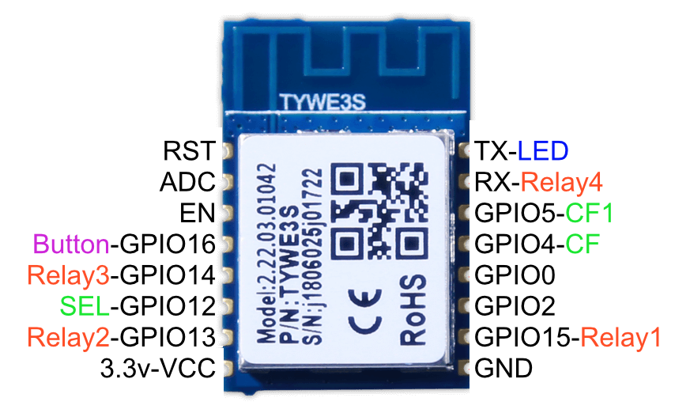

# RCE-2-WF
Прошивка USB Wi-Fi PRO EKF Connect (TYWE3S) под esphome 

Данное устроство выпускалось с разными чипами:

## Версии модулей

- **v1.0** - ESP8266 (TYWE3S) *неотключаемый блок USB*
- **v1.1** - RTL8710BX
- **v1.1** - BK7231T (CBU) *отключаемый USB*
- **v1.2** - BK7231N (WB2L/WB3S)
- **v2.0** - T34 (WB8S)

У меня устройство на плате TYWE3S, за энергомониторинг отвечает BL0937 поэтому дальнейшее (без изменений) актуально только для данного чипа

Прозвонка пинов дает следующие результаты

## Прошивка устройства
1. Подключение через USB-UART (в моем случае PL2303), к самой плате нужно подпаяться согласно таблице подключения;

2. Снять дамп через esptool невышло, видимо нужно хорошее (или отдельное) питание TYWE3S (но удалось узнать что flash память объемом 2MB);

3. В ESPHome создаем устройство (esp8266); редактируем yaml файл из assets под ваши данные; компилируем прошивку и прошиваем устройство.

## Подключение
| USB-UART        | TYWE3S      |
|-----------------|-------------|
| 3.3v            | VCC         |
| RX              | TX          |
| TX              | RX          |
| GND             | GND         |
| GND             | GPIO0       |

## Основные функции
*Управление из Home Assistant*
 1. Управление 4 розетками по отдельности;
 2. Включение/Отключение всех розеток одновременно;
 3. Отслеживание состояния: Силы тока, Напряжения, Мощности, Энрегии, Состояния защиты.
 4. Режим индикации светодиода:
    - Быстро мигает если сработала защита (независит от режима индикации);
    - Постоянно горит если включена хотя бы одна розетка;
    - Медленно мигает если теряет сигнал WiFi;
    - Не горит если все розетки выключены либо режим индикации отключен.
    
*Управление кнопкой по нажатию:*
 - Включает все розетки если все выключены;
 - Отключает все розетки если включена хотя бы одна.

*Особенности*
 - При одновременном включении всех розеток, розетки включаются последовательно, с задержкой в 200мс;
 - Защита срабатывает при превышении сумарного тока 16А и отключает все розетки;
 - После отработки защиты, защита включается только при нажатии физической кнопки, либо перезагрузке устройства. 

